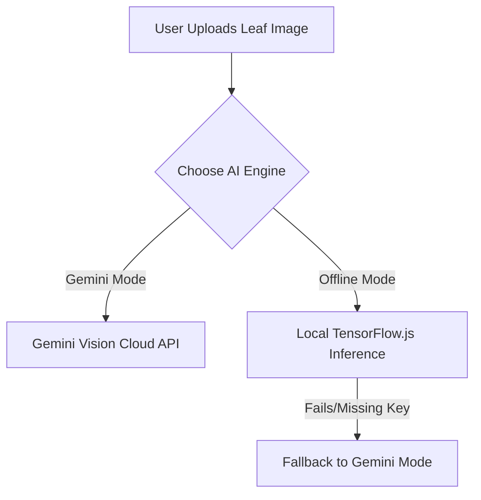

# Offline AI Inference & Model Export Setup Guide

This guide details the architecture, setup, conversion process, and troubleshooting solutions for the Offline AI classification models of KrishiAI/iKhedut.

---

## 1. System Architecture

The KrishiAI app employs a hybrid AI strategy:


### Model Classification Setup
1. **Crop Classifier (`models/crop_model/`)**: A 1-class PyTorch model mapping (customizable to a 15-class or 6-class crop list).
2. **Disease Classifier (`models/disease_model/`)**: Handled by the converted **Keras MobileNetV3Small** model which detects the crop type offline out of 15 candidate priority crops of Gujarat, falling back to a `healthy` state if no disease categories match.

---

## 2. Dependency Prerequisites

Ensure you have python and standard ML packages installed:
```bash
pip install tensorflow tensorflowjs torch torchvision numpy pillow
```

### Dependency Conflicts Workaround
Newer Python environments (Python 3.12+) and TensorFlow versions (TF 2.16+) cause compatibility issues with standard `tensorflowjs` imports due to the deprecation of `numpy.object` and the relocation of `tensorflow.python.training.tracking`. 

Our export pipeline dynamically patches these inside `convert_to_tfjs.py`:
* **NumPy:** Injects missing `np.object`, `np.bool`, etc.
* **Tracking Mock:** Injects a dynamic `tracking` module into `sys.modules` to intercept imports.
* **Protobuf:** Sets `PROTOCOL_BUFFERS_PYTHON_IMPLEMENTATION=python`.
* **Estimator Wrapper:** Monkey-patches `TFModuleWrapper._getattr` to catch estimator references from `tensorflow_hub`.
* **Keras Version Check:** Monkey-patches `tensorflowjs.converters.keras_h5_conversion._check_version` to permit Keras 3 model exports.

---

## 3. Directory Layout
Ensure the following directory structure is set up:
```
/models/
  ├── checkpoints/
  │     ├── krishi_ai_v1_mobilenetv3small_best.keras (Trained Keras Model)
  │     └── krishi_ai_v1_mobilenetv3small_best_classes.json
  ├── crop_model/
  │     ├── crop_model.pth (PyTorch Model)
  │     ├── crop_model_classes.txt (Text)
  │     ├── model.json (TFJS Config)
  │     └── group1-shard*of*.bin (TFJS Weights)
  └── disease_model/
        ├── model.json (TFJS Config)
        └── group1-shard*of*.bin (TFJS Weights)
```

---

## 4. Converting Checkpoints to TensorFlow.js

To export PyTorch models and Keras models to TensorFlow.js format, run the export script:
```bash
python ml_engine/export/convert_to_tfjs.py
```
This script handles the compatibility patches automatically and converts:
1. `models/crop_model/crop_model.pth` -> `models/crop_model/model.json`
2. `models/checkpoints/krishi_ai_v1_mobilenetv3small_best.keras` -> `models/disease_model/model.json`

---

## 5. JavaScript Loading & Inference Flow

The browser logic resides in `js/aiAgent.js` inside `_analyseWithImage()`:
1. **Caching:** Models are checked and loaded only once:
   ```javascript
   this.cropModel = await tf.loadLayersModel('./models/crop_model/model.json');
   this.diseaseModel = await tf.loadLayersModel('./models/disease_model/model.json');
   ```
2. **WebGL Memory Management:** We wrap image pre-processing and inference in `tf.tidy()` to prevent WebGL memory leaks:
   ```javascript
   const prediction = tf.tidy(() => {
       const tensor = tf.browser.fromPixels(img);
       const resized = tf.image.resizeBilinear(tensor, [224, 224]);
       const normalized = resized.toFloat().div(255.0);
       return { ... };
   });
   ```
3. **Dynamic Output Shape Handling:** If the disease model has 15 output dimensions, it acts as a crop classifier and maps indices dynamically to the 15 priority crops of Gujarat, setting the disease state to `healthy`. Otherwise, it maps indices to the standard `DISEASE_CLASSES` array.

---

## 6. Future Model Retraining Workflow

To retrain the models on a fresh crop/disease dataset:
1. Put raw images under `ml_engine/datasets/raw/<category_name>/`.
2. Split and clean the dataset:
   ```bash
   python ml_engine/utils/preprocess_dataset.py
   ```
3. Launch Keras training pipeline:
   ```bash
   python run_training.py --epochs 10 --model MobileNetV3Small
   ```
4. Re-export the best checkpoint (`models/checkpoints/...keras`) to TFJS:
   ```bash
   python ml_engine/export/convert_to_tfjs.py
   ```

---

## 7. Common Errors & Troubleshooting

### Error: `AttributeError: module 'numpy' has no attribute 'object'`
* **Cause:** Deprecations in NumPy 2.x.
* **Solution:** Upgrade your export script to patch the numpy attributes (`numpy.object = object`) dynamically before loading TensorFlowJS.

### Error: `AttributeError: module 'tensorflow.compat.v1' has no attribute 'estimator'`
* **Cause:** `tensorflow-hub` trying to import estimator modules.
* **Solution:** Monkey-patch `tensorflow.python.util.module_wrapper.TFModuleWrapper._getattr` to catch estimator lookups and return a mock object.

### Error: `ValueError: Expected Keras version 2; got Keras version 3.*`
* **Cause:** TFJS converter expecting Keras 2 model structures.
* **Solution:** Patch the version checker in `tensorflowjs.converters.keras_h5_conversion._check_version` so it doesn't raise error.
