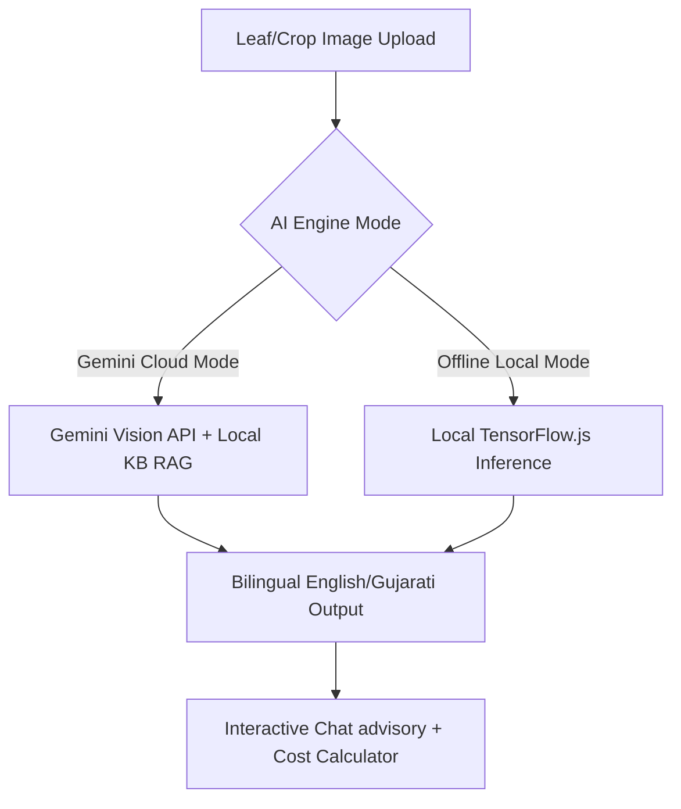

# KrishiAI Project Vision & Philosophy (KES v1.0)

KrishiAI is a premium, sovereign agricultural AI platform designed to empower local farmers with advanced crop diagnostics, yield optimization data, and weather-driven recommendations.

---

## 1. Core Vision

*   **AI Sovereignty:** Farmers must not be beholden to expensive, closed-source, third-party cloud APIs (such as Gemini Vision, ChatGPT, or Claude) for crop and disease detection in final production models.
*   **Offline Independence:** The platform must function at the edge, fully offline in the field. Remote farming areas in India often suffer from intermittent connectivity; hence, model inference must run directly in the browser or on lightweight local edge servers.
*   **Localized Context:** KrishiAI prioritizes agricultural practices specific to Gujarat and India, aligning with government schemes (such as the iKhedut portal) and state agricultural universities (Anand, Junagadh, Navsari, Sardarkrushinagar Dantiwada).
*   **Bilingual Accessibility:** Systems must serve farmers in both **Gujarati (ગુજરાતી)** and **English**, providing instant language transitions.

---

## 2. Platform Tenets

1.  **Farmers First:** The interface must remain clean, highly visual, and free from bloated, confusing layout changes.
2.  **No Mocks, Real Science:** The AI diagnostic engine must run real pixel-level classification (via TensorFlow.js in the browser) and return verified treatments from state agricultural guides. Hardcoded/sequenced demo modes are strictly disallowed in production.
3.  **Local Model Continuous Improvement:** Engineers and agricultural scientists must be able to continuously retrain, refine, and redeploy local neural network checkpoints using custom datasets collected directly from fields.

---

## 3. Technology Strategy

- **Frontend:** Progressive Web App (PWA) with Vanilla JS and CSS for performance, fast load times, and offline capabilities.
- **Deep Learning Model Runner:** Browser-side execution powered by TensorFlow.js, loading lightweight weights files directly from local storage or server assets.
- **Training Engine:** Modular PyTorch/TensorFlow pipelines built in Python, enabling data preparation, model training (via transfer learning), and automated JS converters.
